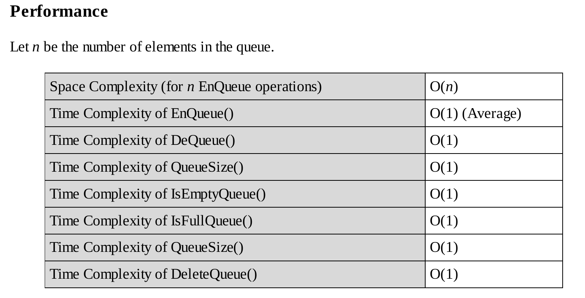

# Dynamic Array based implementation of Queue's

This is the same implementation of queue as the simple circular array one but 
it has a resize function built into it which will automatically resize the 
queue when the size of the array is full and we want to add another element 
to it.

The performance details for this type of implementation is given below:- 

