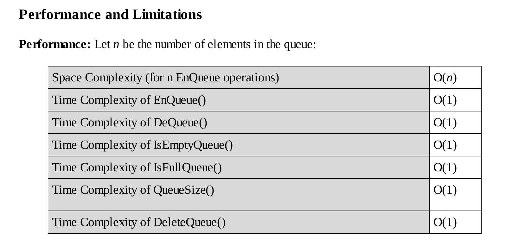

# Queue Simple Circular Array Implementation

This implementation of Queue uses a simple circular array 
to implement the Queue ADT. 

The size of the array has to be predefined and if isn't 
predefined with a number it automatically initializes with a fixed size.

