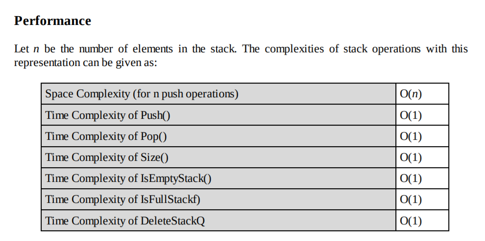

## Stack implementation with Array

This implementation of stack ADT uses an array. In the array, we add elements 
from left to right and use a variable to keep track of the index of the top 
element.

The array storing the stack elements may become full. A push operation will 
then throw a full stack exception. Similarly, if we try deleting an element 
from an empty stack it will throw stack empty exception.

#### Limitations

The maximum size of the stack must first be defined and it cannot be changed. 
Trying to push a new element into a full stack causes an 
implementation-specific exception.
