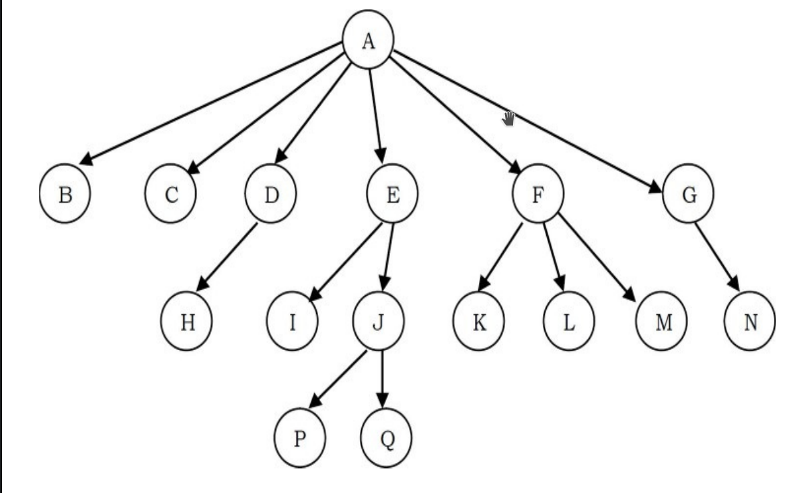
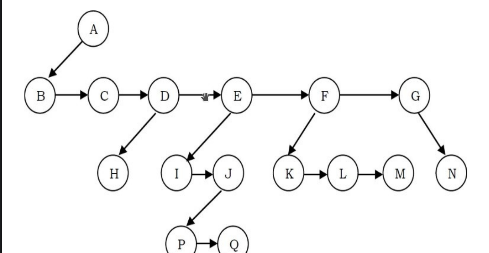

# Generic Tree

Generic Trees or N-ary Trees are trees which can have n-number of nodes for 
each node. Simply said, Each node can have many children's. 

## Representation of Generic Trees

Since, the main objective is to reach all the nodes in the tree a possible 
solution would be 
1. At each node link children of same parent (siblings) from left to right
2. Remove links from parent to all children except the first child. 

With that considered a generic tree which would generally look like this



would end up looking like this in the actual implementation -



After looking at generic trees in a approach like this we can think of generic 
trees that can be considered as a Binary Tree with this type of declaration

```cpp
    struct TreeNode{
        int data;
        struct TreeNode* firstChild;
        struct TreeNode* nextSibling;
    }
```
