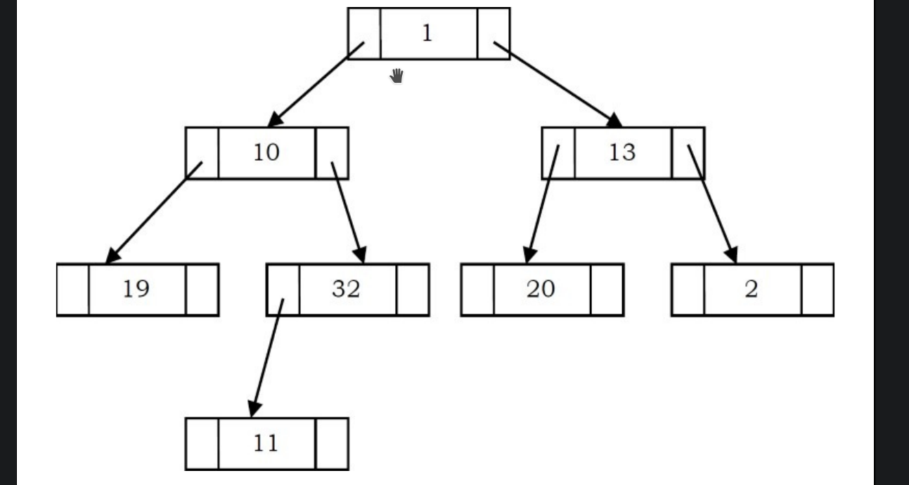

# Threaded Binary Tree Traversal

There are some issues with regular binary tree traversals i.e. stack/queue
approach of going through the tree these are -
1. Storage space required for the stack and queue is large
2. The majority of pointers in any binary tree are NULL. For Example, a binary
tree with n nodes has n+1 NULL pointer's, and these were wasted.
   

3. It is difficult to find successor node (preorder, inorder and postorder
   successors) for a given node.
   
## Motivation for threaded Binary trees.

Traversals of previous kinds had used stacks/queues to record the current 
position inorder to move to right subtree after processing the left subtree.

If we store useful information in these NULL pointers, we won't have to use
stacks/queues. Binary trees where useful information is stored in such NULL
pointers are called Threaded Binary Trees.

Common Convention is to store predecessor/successor information in these null
pointers. i.e. If we are dealing with preorder traversals, then for a node,
NULL left pointer will contain preorder predecessor information and NULL 
right pointer will contain preorder successor information. These special
pointers are called threads.

## Classifying Threaded Binary Trees.

The classification is based on whether we are storing useful information in
both NULL pointers or only in one of them.

1. If we store predecessor information in NULL left pointers only, then we can 
   call such binary trees left threaded binary trees.
2. If we store successor information in NULL right pointers only, then we can
   call such binary trees right threaded binary trees.
3. If we store predecessor information in NULL left pointers and successor
   information in NULL right pointers, then we can call such binary trees
   fully threaded binary trees or simply threaded binary trees.
   
## Types of Threaded Binary Trees.

1. Preorder Threaded Binary Trees: NULL left pointer will contain PreOrder 
   predecessor information and NULL right pointer will contain PreOrder
   successor information.
2. Inorder Threaded Binary Trees: NULL left pointer will contain InOrder 
   predecessor information and NULL right pointer will contain InOrder
   successor information.
3. Postorder Threaded Binary Trees: NULL left pointer will contain PostOrder
   predecessor information and NULL right pointer will contain PostOrder
   successor information.
   

