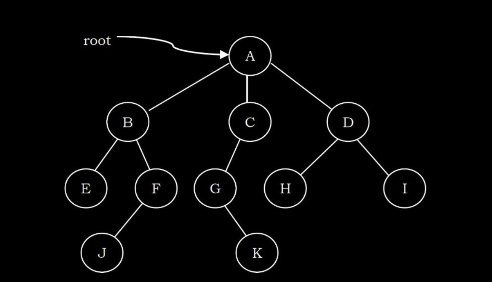
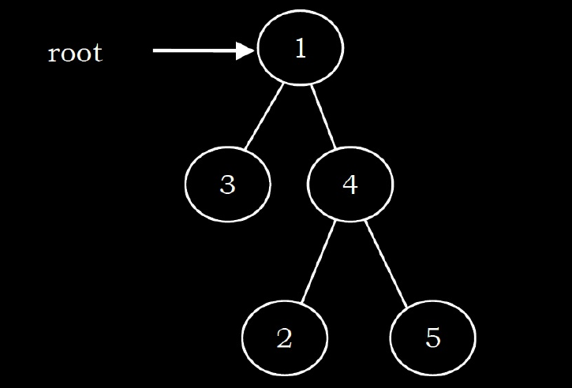
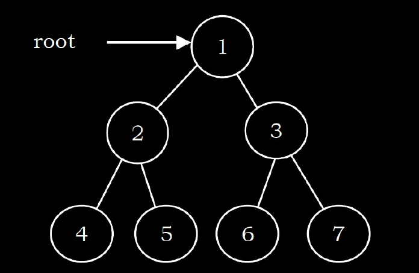
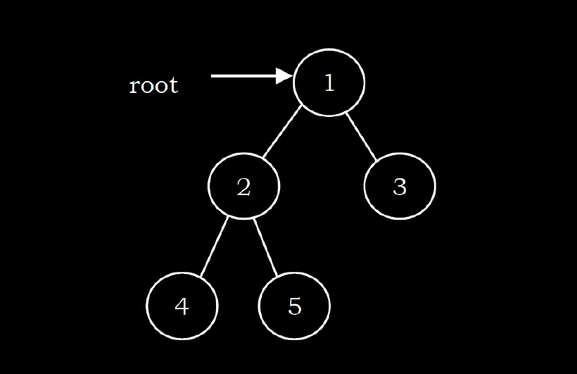

# Trees

A tree is a data structure similar to a linked list but instead of each node 
pointing simply to the next node in a linear fashion, each node points to a 
number of nodes. Tree is an example of a non-linear data structure. A tree 
structure is a way of representing the hierarchical nature of a structure
in a graphical form.

In trees ADT (Abstract Data Type), the order of the elements is not important. 
If we need ordering information, linear data structures like linked lists, 
stacks, queues, etc. can be used.

## Types of trees -

---

* Binary Trees - 
  
    A tree is called binary tree if each node has zero child, one child or two children. Empty tree is
also a valid binary tree. We can visualize a binary tree as consisting of a root and two disjoint
binary trees, called the left and right subtrees of the root.

    Types of Binary Trees -
  
    * Strict Binary Tree:
      
        A binary tree is called strict binary tree if each node has exactly two
      children or no children.
      
    * Full Binary Tree:
  
        A binary tree is called full binary tree if each node has exactly two children
    and all leaf nodes are at the same level.
      

    * Complete Binary Tree:

      Before defining the complete binary tree, let us assume that the height of
      the binary tree is h. In complete binary trees, if we give numbering for the nodes by starting at the
      root (let us say the root node has 1) then we get a complete sequence from 1 to the number of
      nodes in the tree. While traversing we should give numbering for NULL pointers also. A binary
      tree is called complete binary tree if all leaf nodes are at height h or h – 1 and also without any
      missing number in the sequence.
      
